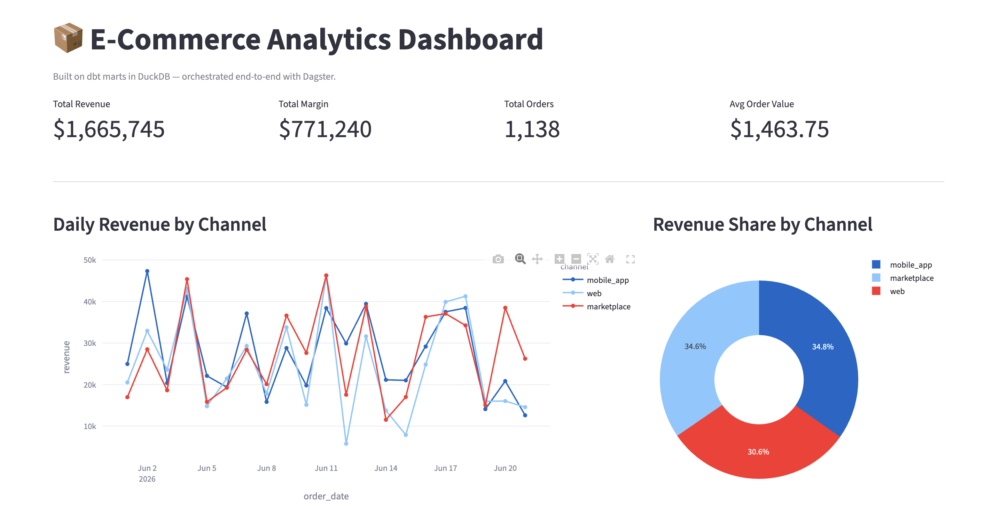
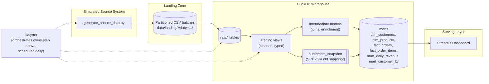

# E-Commerce Analytics Pipeline

An end-to-end batch data pipeline that simulates a real e-commerce source system, ingests and models the data through a modern ELT stack, and serves it through an interactive dashboard — orchestrated, tested, containerized, and CI-checked.

**Stack:** Python · DuckDB · dbt · Dagster · Streamlit · Docker · GitHub Actions

## Dashboard preview



## Why this project

Most portfolio data pipelines stop at "load a CSV, run a query." This one is built to mirror what a production e-commerce analytics pipeline actually has to deal with:

- **Messy source data** — duplicate records, late-arriving payments, orphaned foreign keys, inconsistent casing, missing fields
- **Slowly changing dimensions** — customer profile changes are tracked historically (SCD Type 2), not overwritten
- **Data quality as a first-class concern** — 26 automated dbt tests, with results surfaced in the dashboard rather than hidden
- **Real orchestration** — a Dagster asset graph with actual dependency edges between ingestion and transformation, not just a script that runs steps in sequence

## Architecture



**Layers, in order:**

1. **Ingestion** (`ingestion/`) — `generate_source_data.py` simulates a source system dropping daily batches into a landing zone, deliberately injecting realistic messiness. `load_to_warehouse.py` loads those batches into `raw.*` tables in DuckDB, stamping audit columns (`_source_file`, `_loaded_at`).
2. **Transformation** (`dbt_project/`) — dbt models the data through staging (clean/typed), a snapshot (SCD2 customer history), intermediate (joins/enrichment), and marts (star schema: dimensions + facts + pre-aggregated marts for the dashboard). 26 tests cover uniqueness, referential integrity, accepted values, and not-null constraints.
3. **Orchestration** (`orchestration/`) — Dagster wires the Python ingestion steps and every dbt model/snapshot into a single asset graph with real lineage, and schedules a daily run.
4. **Serving** (`dashboard/`) — a Streamlit app querying the marts directly: revenue trends, channel mix, category performance, top customers, and a data-quality panel.

## Star schema

- `dim_customers` — SCD2, one row per customer per historical state
- `dim_products` — product catalog with computed margin
- `fact_orders` — grain: one row per order
- `fact_order_items` — grain: one row per order line item
- `mart_daily_revenue` / `mart_customer_ltv` — pre-aggregated marts for BI/dashboard consumption

## Running it

### Option A — Docker (recommended, one command)

```bash
docker compose run --rm pipeline   # generates data, loads warehouse, runs dbt
docker compose up dagster          # Dagster UI at http://localhost:3000
docker compose up dashboard        # Streamlit at http://localhost:8501
```

### Option B — Local Python

```bash
python -m venv .venv && source .venv/bin/activate
pip install -r requirements.txt

# Ingest
python ingestion/generate_source_data.py
python ingestion/load_to_warehouse.py

# Transform
cd dbt_project
DBT_PROFILES_DIR=. dbt snapshot
DBT_PROFILES_DIR=. dbt build   # runs models + tests
cd ..

# Orchestrate (optional -- re-runs everything above via Dagster instead)
dagster dev -m orchestration.definitions   # UI at http://localhost:3000

# Serve
streamlit run dashboard/app.py             # http://localhost:8501
```

## Project structure

```
.
├── ingestion/                  # source simulation + warehouse loader
├── dbt_project/
│   ├── models/staging/         # cleaned, typed views over raw sources
│   ├── models/intermediate/    # joins & enrichment
│   ├── models/marts/           # star schema + BI-ready marts
│   └── snapshots/              # SCD2 customer history
├── orchestration/              # Dagster asset definitions & schedule
├── dashboard/                  # Streamlit app
├── docker/, docker-compose.yml # containerized one-command spin-up
└── .github/workflows/ci.yml    # runs the pipeline + dbt tests on every push
```

## Data quality, by design

The generator intentionally injects the kind of mess real pipelines deal with, so the tests below aren't decorative:

| Issue injected | Where it's caught |
|---|---|
| Missing customer emails (~3%) | `dbt test` (warns), surfaced in dashboard |
| Orphaned `product_id` on order items | Flagged in staging, excluded from facts, counted in dashboard |
| Duplicate customer rows (upstream re-send) | Handled by SCD2 snapshot logic |
| Late-arriving payments (paid 1-2 days after order) | Modeled explicitly (`days_to_payment`) |
| Inconsistent country casing/whitespace | Normalized in staging (`title_case` macro) |

## What I'd add next

- Streaming ingestion for a subset of events (e.g. simulate a Kafka topic of live orders) alongside the batch layer
- A cloud deployment target (e.g. swap DuckDB for Snowflake/BigQuery, deploy Dagster on a schedule via a managed runner)
- Great Expectations or dbt's `elementary` package for richer data observability
